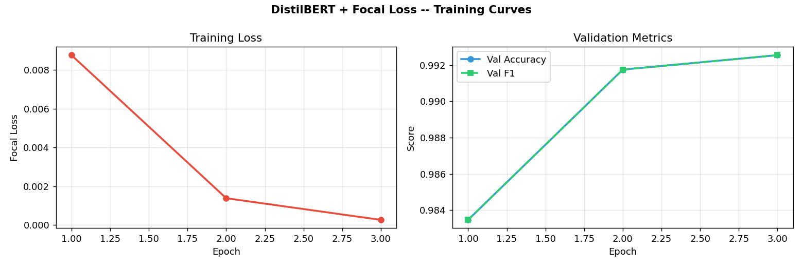
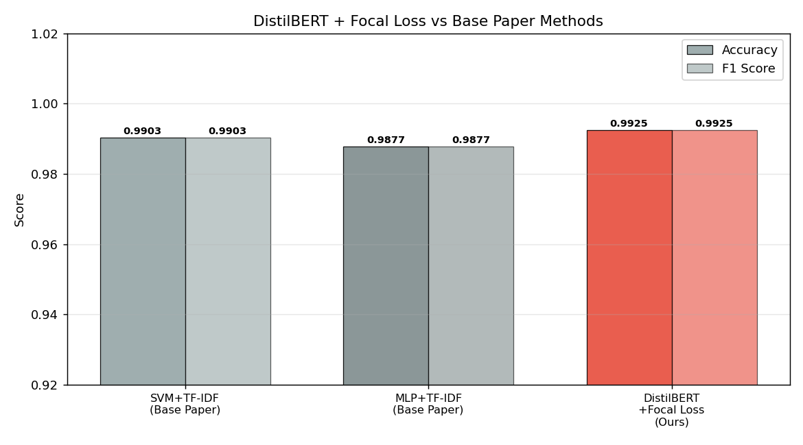
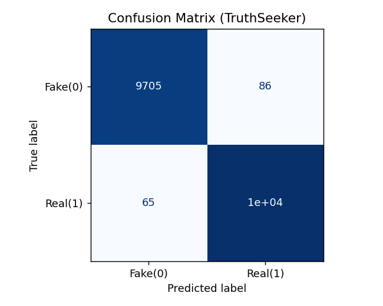

# Contextual Fake News Detection via DistilBERT and Focal Loss

> **99.25% accuracy** on TruthSeeker-2023 — a reproducibility study and transformer-based extension of Al-Tarawneh et al. (2024).

**Authors:** Muhammad Saif Murtaza · Eeshaal Adeel · Ash Al Meeqaat  
**Course:** CS-4112 Deep Learning — BS Data Science (C), FAST-NUCES  
**Instructor:** Dr. Qurat Ul Ain

---

## Overview

This project pursues two goals:

1. **Reproducibility** — Faithfully re-implement the Al-Tarawneh et al. (2024) benchmark of 7 ML classifiers × 3 embedding schemes (TF-IDF, Word2Vec, FastText) on the TruthSeeker-2023 Twitter corpus. All six TF-IDF classifier results landed within ±2% of the paper's reported numbers; the MLP matched exactly at 98.77%.

2. **Extension** — Replace TF-IDF with **DistilBERT** contextual embeddings and swap cross-entropy for **Focal Loss** (γ=2.0, α=0.25), pushing test accuracy to **99.25%** — surpassing the base paper's SVM ceiling of 99.03% by +0.22 points, trained in ~43 minutes on a consumer laptop GPU.

---

## Results Summary

| Model | Source | Accuracy | F1 |
|---|---|---|---|
| SVM + TF-IDF | Base paper (Al-Tarawneh 2024) | 99.03% | 99.03% |
| MLP + TF-IDF | Base paper | 98.77% | 98.77% |
| SVM + TF-IDF | Reproduced | 97.56% | 97.56% |
| MLP + TF-IDF | Reproduced | **98.77%** | **98.77%** |
| **DistilBERT + Focal Loss** | **Ours** | **99.25%** | **99.25%** |

Both Fake and Real classes achieve **0.99 precision, recall, and F1** — no majority-class bias.

---

## Architecture

```
Raw tweet
    │
    ▼
Text Cleaning (lowercase, strip URLs/mentions/hashtags)
    │
    ▼
WordPiece Tokenizer → max 128 tokens
    │
    ▼
DistilBERT (6 layers, 12 heads, 768-dim, ~67M params)
    │
    ▼
[CLS] vector (768-dim)
    │
    ▼
Linear + GELU → Dropout(0.1) → Linear (2 logits)
    │
    ▼
Focal Loss (γ=2.0, α=0.25)
```

**Key design choices:**
- **DistilBERT over TF-IDF** — captures negation, hedging, and framing that bag-of-words misses ("officials *denied* the report" vs "officials *confirmed* the report" get nearly identical TF-IDF vectors).
- **Focal Loss over cross-entropy** — down-weights high-confidence predictions by `(1−p)^γ`, focusing gradient updates on ambiguous boundary cases. At 99% confidence, gradient contribution is ~0.0001×; at 55% confidence, ~0.2025× — a 2000:1 ratio.

---

## Dataset

| Dataset | Size | Split | Purpose |
|---|---|---|---|
| [TruthSeeker-2023](https://ieee-dataport.org/documents/truthseeker) | 134,194 tweets | 70/15/15 | Primary train/val/test |
| [ISOT](https://www.kaggle.com/datasets/clmentbisaillon/fake-and-real-news-dataset) | ~44k articles (20k sampled) | — | Cross-domain evaluation |

TruthSeeker spans 13 years (2009–2022), annotated via crowdsourcing + expert review. Labels: 51.4% Real / 48.6% Fake.

> **Note:** `Truth_Seeker_Model_Dataset.csv` is not included due to file size. Download from [IEEE DataPort](https://ieee-dataport.org/documents/truthseeker) and place in the `data/` directory.  
> `best_model_focal.pt` (~256MB) is also excluded — train from scratch or request via the authors.

---

## Project Structure

```
fake-news-detection/
├── src/
│   └── train.py                  # Full training pipeline
├── notebooks/
│   └── distilbert_focal_loss.ipynb  # Interactive notebook version
├── data/
│   ├── Fake.csv                  # ISOT fake news (cross-domain eval)
│   ├── True.csv                  # ISOT real news (cross-domain eval)
│   └── Truth_Seeker_Model_Dataset.csv 
├── models/
│   └── best_model_focal.pt       # ← place here (not included, ~256MB)
├── plots/
│   ├── learning_curve.png        # Training loss & validation metrics per epoch
│   ├── model_comparison.png      # Accuracy/F1: ours vs base paper
│   ├── confusion_matrix.png      # Per-class confusion matrix
│   └── cross_domain.png          # In-domain vs ISOT cross-domain accuracy
├── results.csv                   # Final benchmark numbers
├── requirements.txt
└── README.md
```

---

## Setup & Usage

### 1. Install dependencies

```bash
pip install -r requirements.txt
```

### 2. Prepare data

Place `Truth_Seeker_Model_Dataset.csv` in the `data/` directory (downloaded separately from IEEE DataPort).

### 3. Train

```bash
python src/train.py
```

This will:
- Load and preprocess TruthSeeker-2023
- Fine-tune DistilBERT with Focal Loss for 3 epochs
- Save `best_model_focal.pt` (best validation epoch)
- Output test metrics and save plots to `plots/`
- Run cross-domain evaluation on ISOT (if CSVs present in `data/`)

### 4. Expected output

```
[✓] Device : cuda
[✓] GPU    : NVIDIA RTX 4050 Laptop GPU

Epoch 1/3 | loss=0.0088 | val_acc=0.9835 | val_f1=0.9835
Epoch 2/3 | loss=0.0014 | val_acc=0.9918 | val_f1=0.9918
Epoch 3/3 | loss=0.0003 | val_acc=0.9925 | val_f1=0.9925

TEST RESULTS
  DistilBERT + Focal Loss (PROPOSED)  Acc=0.9925  Prec=0.9925  Rec=0.9925  F1=0.9925
```

---

## Training Configuration

| Parameter | Value |
|---|---|
| Base model | `distilbert-base-uncased` |
| Loss function | Focal Loss (γ=2.0, α=0.25) |
| Epochs | 3 |
| Batch size | 32 |
| Learning rate | 2×10⁻⁵ (cosine schedule + 6% warmup) |
| Max sequence length | 128 tokens |
| Optimizer | AdamW (decay=0.01, grad clip=1.0) |
| Hardware | NVIDIA RTX 4050 Laptop GPU |
| Training time | ~43 minutes |

---

## Training Curves



Training loss drops from 0.0088 → 0.0003 over 3 epochs with monotonically improving validation accuracy. No overfitting observed.

---

## Model Comparison



---

## Confusion Matrix



---

## Key Findings

- **TF-IDF + KNN inversion**: KNN accuracy flips from 77.83% (TF-IDF) to 97.64% (Word2Vec) — a textbook illustration of the curse of dimensionality in high-dimensional sparse spaces. Not highlighted in the original paper.
- **Focal Loss efficiency**: With γ=2.0, the gradient ratio between ambiguous (55% confidence) and easy (99% confidence) predictions is ~2000:1. This forces the model to spend learning capacity on the hard boundary cases.
- **Fixed memory footprint**: DistilBERT's 67M parameters don't grow with corpus size, unlike TF-IDF whose feature matrix expands with vocabulary — simpler to deploy at scale.

---

## Citation

If you use this work, please cite:

```bibtex
@misc{murtaza2024fakenews,
  title={Contextual Fake News Detection via DistilBERT and Focal Loss: A Reproducibility Study and Transformer-Based Extension},
  author={Murtaza, Muhammad Saif and Adeel, Eeshaal and Al Meeqaat, Ash},
  year={2024},
  institution={FAST-NUCES},
  note={CS-4112 Deep Learning Course Project}
}
```

**Base paper:**
> Al-Tarawneh et al. (2024). Enhancing Fake News Detection with Word Embedding: A Machine Learning and Deep Learning Approach. *MDPI Computers*, 13(9), 239.

---

## References

- [DistilBERT](https://arxiv.org/abs/1910.01108) — Sanh et al. (2019)
- [Focal Loss](https://arxiv.org/abs/1708.02002) — Lin et al. (2017)
- [BERT](https://arxiv.org/abs/1810.04805) — Devlin et al. (2018)
- [TruthSeeker-2023](https://ieee-dataport.org/documents/truthseeker) — Dadkhah et al. (2024)
- [HuggingFace Transformers](https://github.com/huggingface/transformers) — Wolf et al. (2020)
